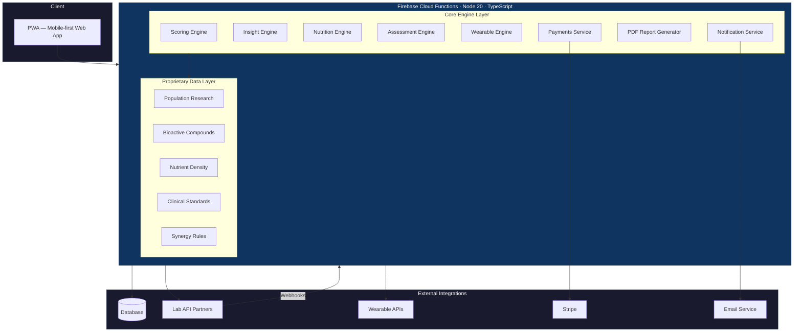
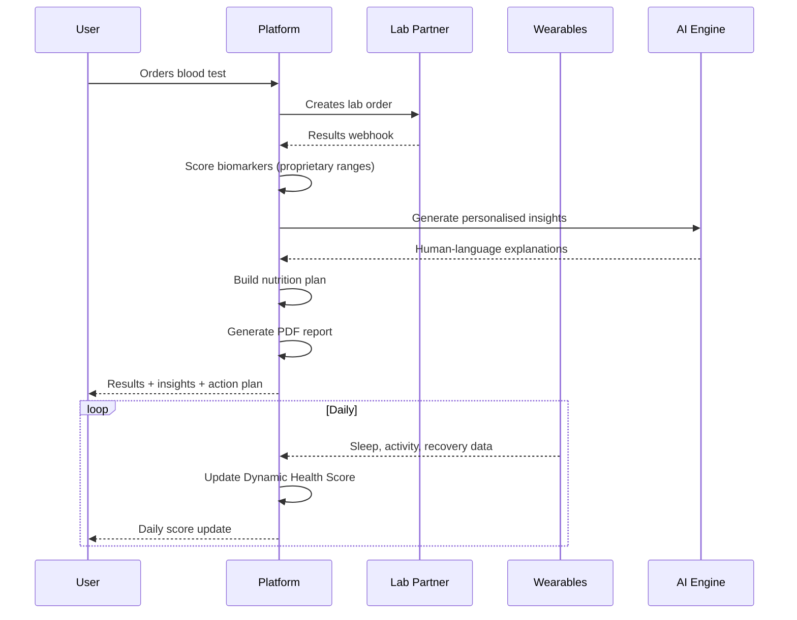

# Omniwo — Longevity Intelligence Platform


> **We show people what standard labs miss — and tell them exactly what to do about it.**

Omniwo is a longevity-focused health platform launching in the UK. We combine lab-grade blood testing (40–90 biomarkers) with wearable device data, AI-powered insights, and personalised daily protocols to help people understand and optimise their biology.

We are a **wellness intelligence platform** that uses proprietary longevity-optimised reference ranges instead of standard clinical "normal" ranges — catching patterns that standard labs miss, and explaining them in human language, not medical jargon.

---

## The Problem

Standard blood tests tell you: *"Your results are normal."*

But "normal" means "not sick yet." For people who want to **optimise** — not just avoid disease — standard ranges are far too wide. We bridge that gap with research-backed optimal ranges and AI-driven personalisation.

---

## System Architecture



---

## How It Works



---

## Tech Stack

| Layer | Technology |
|-------|-----------|
| **Runtime** | Firebase Cloud Functions, Node 20, TypeScript (strict mode) |
| **Database** | NoSQL, real-time |
| **Lab Integration** | REST API + Webhooks (HMAC-verified, idempotent) |
| **Wearables** | Oura Ring + Whoop, expandable to 600+ devices |
| **AI Layer** | LLM-powered personalised narratives |
| **Payments** | Stripe |
| **Email** | Transactional + lifecycle email system |
| **PDF Generation** | Personalised test reports |
| **CI/CD** | GitHub Actions (3 workflows: lint, test, build) |
| **Testing** | Jest (unit + integration) |

---

## Codebase Metrics

```
Source files:          82 TypeScript modules
Test suites:           28
Tests passing:         1,062
Build errors:          0
Lint errors:           0
Code style:            TypeScript strict — zero 'any' types
```

---

## Core Engineering Capabilities

### Proprietary Scoring Engine
Multi-layer health scoring system that goes beyond simple range checking. Applies population-level research to classify biomarkers into 4 bands — from optimal to requiring attention — with weighted category scoring across 12 health domains.

**[View code sample →](code-samples/scoring-engine.ts)**

### AI Insight Generation
Template-based + AI-enhanced insight engine that generates personalised, human-language explanations for every out-of-range marker. Includes a unique **longevity context layer** that explains why we flag markers that standard labs consider "normal."

**[View code sample →](code-samples/longevity-context.ts)**

### Multi-Source Nutrition Engine
5-stage pipeline that generates personalised food recommendations by cross-referencing multiple scientific databases. Goes beyond "eat salmon" — we tell users **how much**, **when**, **how to prepare**, what **blocks absorption**, and what **amplifies** it.

### Food Synergy & Intelligence Engine
Proprietary rule engine that identifies food-food interactions relevant to the user's biomarker profile:
- Absorption enhancers (what to combine)
- Hidden blockers (what to avoid together)
- Precision dosages, timing hacks, preparation methods
- Food-as-supplement replacements

**[View code sample →](code-samples/food-synergy-engine.ts)**

### Lab Integration Pipeline
Secure webhook-based integration with lab partners. Features HMAC signature verification, replay attack protection, idempotent processing, and a structured async pipeline from raw results to user-facing insights.

**[View code sample →](code-samples/webhook-handler.ts)**

### Wearable Data Sync
Multi-provider normalisation layer that transforms raw wearable data (Oura, Whoop) into a unified format. Handles data validation, daily scoring, and feeds into the Dynamic Health Score engine.

**[View code sample →](code-samples/wearable-sync.ts)**

### Biological Age Calculator
Estimates biological age from blood biomarkers — "Your body is aging 3.8 years slower than average." A powerful engagement metric that resonates with longevity-focused users.

### Contextual Assessment Engine
When biomarker patterns suggest a lifestyle factor, we trigger targeted questionnaires instead of making assumptions. User answers modify insight generation in real-time — suppressing irrelevant advice and unlocking personalised protocols.

### Multi-Marker Correlation Engine
Pattern matching across multiple biomarkers for deeper clinical insights. Identifies compound patterns that single-marker analysis misses.

### Dynamic Health Score
A living score that combines blood test data with daily wearable metrics. Blood component decays over time, incentivising retesting. Wearable component updates daily.

---

## Data & Research Foundation

Our recommendations are built on multiple large-scale research databases:
- **Population health research** — optimal ranges derived from healthy population data (not "sick vs not sick" clinical ranges)
- **Bioactive compound databases** — tens of thousands of compound-to-health-effect mappings
- **Nutrient density databases** — thousands of whole foods ranked by nutrient content
- **National clinical standards** — UK clinical guidelines as context layer
- **Published research** — evidence-backed insight generation via academic API integration

All data pipelines are proprietary — built in-house with custom filtering, unit conversion, and quality controls.

---

## Quality Standards

- **TypeScript strict mode** — no `any` types, full type safety
- **1,062 automated tests** — every engine, every config, real-world scenarios
- **3 CI/CD workflows** — lint, test, and build run on every push
- **Zero tolerance** — 0 build errors, 0 lint errors at all times
- **Architecture review** — every feature reviewed before merge

---

## Product Principles

1. **Human language first** — medical terms always explained in plain English
2. **Never diagnose** — we observe patterns, not conditions
3. **Natural approaches first** — food → lifestyle → supplements → GP only when critical
4. **Longevity framing** — we explain why we flag things standard labs don't
5. **Empower, not alarm** — celebrating wins, gently nudging improvements

---

## Code Samples

| Sample | Description |
|--------|------------|
| [scoring-engine.ts](code-samples/scoring-engine.ts) | Multi-layer health scoring with proximity-based decay |
| [food-synergy-engine.ts](code-samples/food-synergy-engine.ts) | Food interaction matching with fuzzy name resolution |
| [longevity-context.ts](code-samples/longevity-context.ts) | Bridging clinical vs optimal range explanations |
| [webhook-handler.ts](code-samples/webhook-handler.ts) | Secure lab results webhook with HMAC + idempotency |
| [wearable-sync.ts](code-samples/wearable-sync.ts) | Multi-provider wearable data normalisation pipeline |

> All samples are simplified demonstrations. Proprietary ranges, weights, thresholds, and business logic are omitted.

---

## Status

| Area | Status |
|------|--------|
| **Backend** | Production-ready (1,062 tests, 0 errors) |
| **Frontend** | In design phase (working with design studio) |
| **Lab partnership** | Secured |
| **Wearable integration** | Built and tested |
| **Target market** | UK |
| **Launch** | 2026 |

---

## Team

**Islam** — Technical Founder. Built entire backend from zero to production-ready.
**Igor** — Co-Founder.

---

## Contact

**Islam** — Technical Founder, Omniwo
GitHub: [@Islam0953](https://github.com/Islam0953)

---

*This is a public portfolio repository. The production codebase is in a private repository.*
